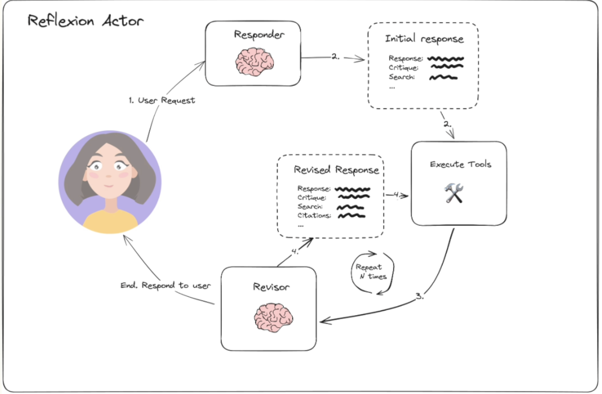
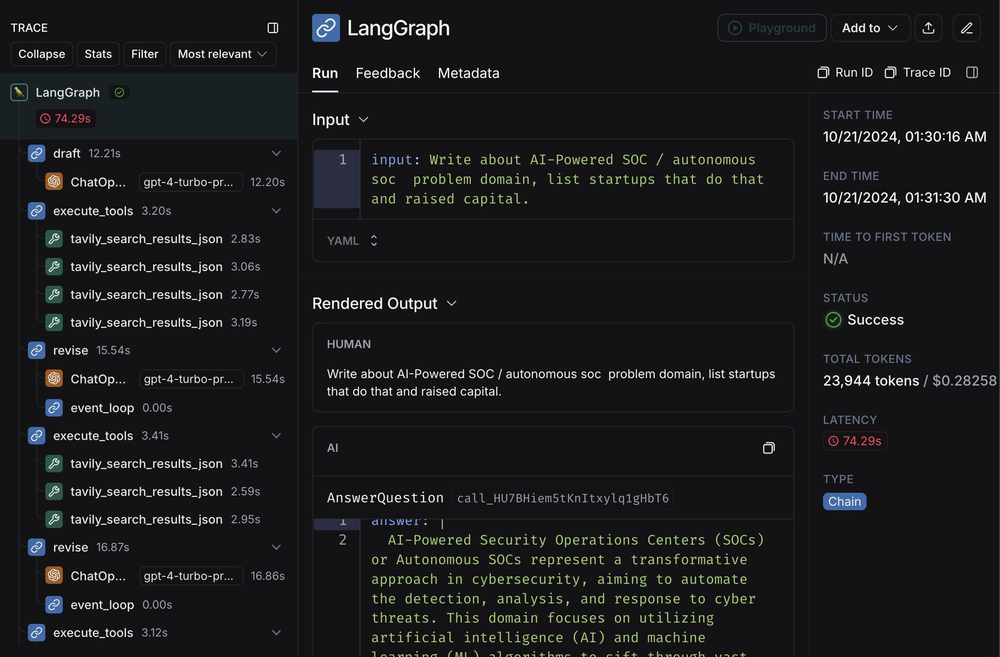

# LangGraph-reflexion-agent
Sandbox for LangGraph. In this example, LangGraph used to constantly self improved generated topic with search engine



## setup
- install python3
- install dependencies `pip3 install -r requirements.txt`
- set .env file with api key of supported llm
```ini
MISTRAL_API_KEY=S0m#-Ap1_K#y-F0r_MiStR@L
OPENAI_API_KEY=S0m#-Ap1_K#y-F0r_OPENAI
TAVILY_API_KEY=S0m#-Ap1_K#y-F0r_TAVILY
LANGCHAIN_API_KEY=S0m#-Ap1_K#y-F0r_LANGCHAIN
LANGCHAIN_TRACING_V2=true
LANGCHAIN_ENDPOINT=https://api.smith.langchain.com
LANGCHAIN_PROJECT=reflecxion agent
```
- set instruction in [`main.py`](main.py)
```python
res = graph.invoke(
    "Write about AI-Powered SOC / autonomous soc  problem domain, list startups that do that and raised capital."
)
```

## execute
`python3 main.py`

## check output in LangSmith
- results: https://smith.langchain.com/public/e2b7c859-3a03-48ff-9fb0-a34f212fa77b/r
- preview: 

## output example
```
AI-Powered Security Operations Centers (SOCs) leverage artificial intelligence (AI) and machine learning (ML) to automate threat detection, analysis, and response, representing a significant evolution in cybersecurity. This approach addresses challenges like integrating AI with existing security frameworks, ensuring AI systems continuously adapt to evolving threats, and balancing automation with human oversight to mitigate false positives.

Several startups have shown remarkable growth in this area, underscoring the sector's dynamism and the trust investors place in AI-driven security solutions:

1. **Darktrace** has raised over $239M, with its AI-driven technologies offering autonomous response capabilities to threats, showcasing significant market trust and a valuation of $1.65 billion by a Series E funding round [1][2].
2. **Vectra AI**, with a $130 million funding round at a $1.2 billion valuation, focuses on AI-driven network detection and response, indicating strong market positioning and potential for growth [3].
3. **Arctic Wolf**, specializing in SOC-as-a-Service augmented by AI, raised $401M in its latest round, bringing its total funding to $879M, reflecting a robust growth trajectory and a $4.3 billion valuation [4].
4. **Socure** raised $450M in a Series E round at a $4.5 billion valuation, focusing on AI for identity verification and fraud prevention, marking it as a pivotal player in the identity verification space [5].

These examples highlight the significant investment and confidence in AI-powered SOCs as critical components of future cybersecurity strategies.
[HumanMessage(content='Write about AI-Powered SOC / autonomous soc  problem domain, list startups that do that and raised capital.', additional_kwargs={}, response_metadata={}, id='b3d0ed2e-c6a5-4587-b8f7-877bd0592ae0'), AIMessage(content='', additional_kwargs={'tool_calls': [{'id': 'call_HU7BHiem5tKnItxylq1gHbT6', 'function': {'arguments': '{"answer":"AI-Powered Security Operations Centers (SOCs) or Autonomous SOCs represent a transformative approach in cybersecurity, aiming to automate the detection, analysis, and response to cyber threats. This domain focuses on utilizing artificial intelligence (AI) and machine learning (ML) algorithms to sift through vast amounts of data, identifying anomalies and potential security incidents faster and more accurately than traditional, human-only operations. The problem domain encompasses several challenges, including the integration of AI technologies with existing security infrastructure, the need for continuous learning and adaptation by AI systems to evolving threats, and the balance between automation and human oversight to avoid false positives and ensure accurate threat intelligence.\\n\\nSeveral startups have ventured into the AI-powered SOC domain, raising significant capital to advance their technologies and market presence. Examples include:\\n\\n1. **Darktrace** - Known for its AI-driven cyber defense solutions, Darktrace has raised substantial funding, positioning itself as a leader in autonomous cyber defense.\\n2. **Vectra AI** - Specializes in AI-driven network detection and response, Vectra AI has secured multiple rounds of financing to support its growth.\\n3. **Arctic Wolf** - Offers cybersecurity solutions with a focus on SOC-as-a-Service, leveraging AI to enhance threat detection and response capabilities. Arctic Wolf has attracted considerable investment to fuel its expansion.\\n4. **Socure** - While not a traditional SOC, Socure applies AI in identity verification and fraud prevention, areas critical to cyber defense, and has raised significant capital.\\n","reflection":{"missing":"The reflection could have included specific figures regarding the amount of capital raised by each startup, which would provide a clearer picture of their market presence and investor confidence. Additionally, mentioning the year of the fundraising rounds or the total funding amount would have given a more comprehensive understanding of the current landscape.","superfluous":"The introduction to the AI-powered SOC problem domain might have been slightly more detailed than necessary for a user already familiar with the concept. Focusing more on the startups and their achievements could have been more beneficial."},"search_queries":["Darktrace total funding amount","Vectra AI latest funding round","Arctic Wolf capital raised","Socure fundraising details"]}', 'name': 'AnswerQuestion'}, 'type': 'function'}], 'refusal': None}, response_metadata={'token_usage': {'completion_tokens': 443, 'prompt_tokens': 241, 'total_tokens': 684, 'completion_tokens_details': {'audio_tokens': None, 'reasoning_tokens': 0}, 'prompt_tokens_details': {'audio_tokens': None, 'cached_tokens': 0}}, 'model_name': 'gpt-4-0125-preview', 'system_fingerprint': None, 'finish_reason': 'stop', 'logprobs': None}, id='run-6681ac30-55e9-4a88-8256-7b1277010005-0', tool_calls=[{'name': 'AnswerQuestion', 'args': {'answer': 'AI-Powered Security Operations Centers (SOCs) or Autonomous SOCs represent a transformative approach in cybersecurity, aiming to automate the detection, analysis, and response to cyber threats. This domain focuses on utilizing artificial intelligence (AI) and machine learning (ML) algorithms to sift through vast amounts of data, identifying anomalies and potential security incidents faster and more accurately than traditional, human-only operations. The problem domain encompasses several challenges, including the integration of AI technologies with existing security infrastructure, the need for continuous learning and adaptation by AI systems to evolving threats, and the balance between automation and human oversight to avoid false positives and ensure accurate threat intelligence.\n\nSeveral startups have ventured into the AI-powered SOC domain, raising significant capital to advance their technologies and market presence. Examples include:\n\n1. **Darktrace** - Known for its AI-driven cyber defense solutions, Darktrace has raised substantial funding, positioning itself as a leader in autonomous cyber defense.\n2. **Vectra AI** - Specializes in AI-driven network detection and response, Vectra AI has secured multiple rounds of financing to support its growth.\n3. **Arctic Wolf** - Offers cybersecurity solutions with a focus on SOC-as-a-Service, leveraging AI to enhance threat detection and response capabilities. Arctic Wolf has attracted considerable investment to fuel its expansion.\n4. **Socure** - While not a traditional SOC, Socure applies AI in identity verification and fraud prevention, areas critical to cyber defense, and has raised significant capital.\n', 'reflection': {'missing': 'The reflection could have included specific figures regarding the amount of capital raised by each startup, which would provide a clearer picture of their market presence and investor confidence. Additionally, mentioning the year of the fundraising rounds or the total funding amount would have given a more comprehensive understanding of the current landscape.', 'superfluous': 'The introduction to the AI-powered SOC problem domain might have been slightly more detailed than necessary for a user already familiar with the concept. Focusing more on the startups and their achievements could have been more beneficial.'}, 'search_queries': ['Darktrace total funding amount', 'Vectra AI latest funding round', 'Arctic Wolf capital raised', 'Socure fundraising details']}, 'id': 'call_HU7BHiem5tKnItxylq1gHbT6', 'type': 'tool_call'}], usage_metadata={'input_tokens': 241, 'output_tokens': 443, 'total_tokens': 684, 'input_token_details': {'cache_read': 0}, 'output_token_details': {'reasoning': 0}}), ToolMessage(content='{"Darktrace total funding amount": [{"url": "https://www.techmonitor.ai/technology/cybersecurity/darktrace-funding-round", "content": "A $50 million Series E funding round by Cambridge-headquartered AI cybersecurity specialist Darktrace values it at $1.65 billion - up $400 million in just four months. Darktrace, which names AIG, London Gatwick Airport and the Science Museum Group among its customers, has now raised a total of $229.5M in funding over 6 rounds."}, {"url": "https://tracxn.com/d/companies/darktrace/__nBscPvA3rXOgIewRiC2vMdIe62-h_Borv7YzXe1Lf-8/funding-and-investors", "content": "Open Access - raised a funding of $748K in Seed round held on 14 Aug, 2024. DRIFT - raised a funding of $6.41M in Series A round held on 14 Aug, 2024. Darktrace has raised a total funding of $239M over 7 rounds from 20 investors. Investors include Summit Partners, KKR and 18 others. Their latest funding round was of $100K on Jul 16, 2019 ."}, {"url": "https://darktrace.com/news/darktrace-raises-series-e-at-1-65bn-valuation", "content": "September 27, 2018. Darktrace, the world\'s leading AI company for cyber defense, has today announced that it has raised $50 million in Series E funding at a valuation of $1.65 billion. The investment is led by Vitruvian Partners with participation from existing investors KKR and 1011 Ventures. Darktrace continues to define the cyber defense"}, {"url": "https://www.cbinsights.com/company/darktrace/financials", "content": "Funding, Valuation & Revenue. 11 Fundings. Darktrace has raised $232.3M over 11 rounds.. Darktrace\'s latest funding round was a Take Private for on October 1, 2024.. Darktrace\'s valuation in April 2021 was $2,348.58M.. Darktrace\'s latest post-money valuation is from October 2024.. Sign up for a free demo to see Darktrace\'s valuations in October 2024, September 2018, May 2018, July 2017 and more."}, {"url": "https://www.crunchbase.com/organization/darktrace/company_financials", "content": "Funding. Darktrace has raised a total of. obfuscated. in funding over 10 rounds. Their latest funding was raised on Mar 25, 2020 from a Post-IPO Secondary round. Darktrace is registered under the ticker LSE:DARK . Their stock opened with \\u00a3250.00 in its Apr 30, 2021 IPO. Darktrace is funded by 13 investors. Brighton Park Capital and Kohlberg"}], "Vectra AI latest funding round": [{"url": "https://www.crn.com/news/security/vectra-raises-130m-to-fuel-r-d-around-cloud-security", "content": "Vectra AI has closed a $130 million funding round on a $1.2 billion valuation to drive more investment around securing Platform-as-a-Service (PaaS) technologies."}, {"url": "https://aimagazine.com/ai-strategy/vectra-ai-raises-dollar130m-dollar12b-valuation", "content": "Vectra AI, a company that applies artificial intelligence (AI) that detects and responds to hidden cyber attackers inside cloud, data center, and enterprise networks, has announced it has raised $130 million in a funding round that values the company at $1.2 billion.. The California-based company has said the investment will continue to help their growth and expansion into new markets and"}, {"url": "https://pitchbook.com/newsletter/blackstone-leads-130m-round-for-threat-detection-company", "content": "Blackstone has led a $130 million funding round for Vectra AI, the San Jose-based creator of a threat detection and response platform for corporate networks, private data centers and the cloud.The round values the company at $1.2 billion, up from the $420 million valuation it reached with a $100 million round in 2019, according to PitchBook data."}, {"url": "https://www.vectra.ai/about/news/vectra-ai-raises-130-million-led-by-blackstone-growth", "content": "SAN JOSE, Calif., April 29, 2021 \\u2014 Vectra AI, a leader in threat detection and response today announced a $130 million round of funding led by funds managed by Blackstone Growth (BXG, \\"Blackstone Growth\\").The investment will help fuel Vectra\'s continued growth through platform innovation and expansion into new markets and geographies, solidifying its Cognito platform as a market"}, {"url": "https://www.blackstone.com/news/press/vectra-ai-raises-130-million-led-by-blackstone-growth-bxg/", "content": "April 29, 2021. Investment will fuel research and development to secure the cloud using AI-driven threat detection and response and global expansion. SAN JOSE, Calif \\u2014 Vectra AI, a leader in threat detection and response today announced a $130 million round of funding led by funds managed by Blackstone Growth (BXG, \\"Blackstone Growth\\")."}], "Arctic Wolf capital raised": [{"url": "https://tracxn.com/d/companies/arctic-wolf/__yHu8ITJfb7Ji49m1Zz1OTmwBp4f2W-BbntzU8YDXPTU/funding-and-investors", "content": "Arctic Wolf has raised a total funding of $879M over 8 rounds from 28 investors. Investors include TriplePoint Capital, Adams Street Partners and 26 others. Their latest funding round was of $401M on Oct 06, 2022 ."}, {"url": "https://finance.yahoo.com/news/security-startup-arctic-wolf-raises-121049889.html", "content": "Arctic Wolf, which raised equity financing at a valuation of $4.3 billion in July 2021, has been working with banks on IPO preparations since the beginning of this year. News Today\'s news"}, {"url": "https://arcticwolf.com/resources/press-releases/arctic-wolf-announces-150-million-series-f-financing-round/", "content": "We believe the company is\\u00a0emerging as the clear leader in the market, and is\\u00a0an essential partner to every organization today that is challenged by the\\u00a0skills shortage in cybersecurity and at the same time is looking to securely take advantage of mega technology trends that are driving the need to adopt solutions like the Arctic Wolf platform to secure cloud, network, and data assets,\\u201d said\\u00a0Pravin Vazirani, managing director and co-head of Technology Investing, Owl Rock, a division of Blue Owl Capital.\\n Arctic Wolf Announces $150 Million Series F Financing Round\\nFastest-growing cloud-native Security Operations leader valued at $4.3 billion on the heels of explosive customer demand for its security platform and services\\nEDEN PRAIRIE,\\u00a0MN \\u2013 July 13, 2021 \\u2013 Arctic Wolf\\u00ae, a leader in security operations, today announced that the company has executed a financing round of $150 million, with Viking Global Investors, Owl Rock, a division of Blue Owl Capital, and other existing investors. Worldwide spending on information security and risk management technology and services is forecast to grow 12.4% to reach $150.4 billion in 2021, according to Gartner.[1]\\nIn the past year, the company has expanded its customer base with a cross-section of mid-market and enterprise business and now reports 438% year-over-year ARR growth in large enterprise customers.\\n * Onboarded approximately 400 new employees in the last twelve months, with plans to add 500 new roles in the coming year\\nRecently, the company launched a new Managed Security Awareness solution, a radical new approach to security and awareness training that helps organizations build cyber resilience against human-based attacks, thus tapping into the growing market demand for security awareness and training. Apply today\\nAbout\\u00a0Arctic\\u00a0Wolf:\\nArctic Wolf\\u00ae is the market leader in security operations, pioneering the first cloud-native\\u00a0security\\u00a0operations\\u00a0platform to end cyber risk."}, {"url": "https://pitchbook.com/profiles/company/56921-59", "content": "What is Arctic Wolf\'s current revenue? The current revenue for Arctic Wolf is . How much funding has Arctic Wolf raised over time? Arctic Wolf has raised $1.06B. Who are Arctic Wolf\'s investors? 2B Global Capital, Artisanal Ventures, Capital Advantage Ventures, Evolution Equity Partners, and Kingfisher Investment Advisors are 5 of 47"}, {"url": "https://techcrunch.com/2021/07/13/arctic-wolf-series-f/", "content": "This round was led by Viking Global Investors, Owl Rock and other existing investors, and lands less than a year after the company\\u2019s last round of investment when it became the first managed detection and response (MDR) company to secure a valuation of over $1 billion. \\u201cWe\\u2019ve got letters of intent for a couple more, and I expect that over the next year we\\u2019ll probably do between five and 10 acquisitions,\\u201d said NeSmith.\\nWith Series F funding under its belt, Arctic Wolf is now starting to think about its exit strategy. The company, which provides round-the-clock security monitoring for small and mid-sized organizations through its cloud security operations platform, saw its revenues double on rapid platform adoption growth, with nearly 60% of its 3,000 customers using at least three of its security operations solutions. This, the company claims, makes it the fastest-growing company at scale in the fastest-growing area of the cybersecurity market.\\n This latest round brings its total amount of funding raised to date to just shy of $500 million, and sees the company\\u2019s valuation soar from $1.3 billion to $4.3 billion.\\n"}], "Socure fundraising details": [{"url": "https://techcrunch.com/2021/11/09/identity-verification-startup-socure-raises-450m-at-4-5b-valuation-adding-tiger-global-as-new-investor/", "content": "The company plans to use the funds in two ways \\u2014 to execute on its mission to \\u201cverify 100% of good identities and completely eliminate identity fraud\\u201d and to increase its investments \\u201cacross the entire identity verification lifecycle,\\u201d further developing proofing and authentication processes, per Ayers. The round brings the company\\u2019s valuation to $4.5 billion, up from $1.3 billion this March when it raised $100 million for its Series D. Its new valuation makes Socure the highest-valued private company in the identity verification space, according to the company.\\n \\u201cMost players in the space have created point solutions to solve one aspect of digital identity \\u2013 name, address, device, email, or phone number \\u2013 but lack the data science insights of Socure\\u2019s Sigma+ score that definitively and reliably answers two questions using their multivariate data: \\u2018Is the applicant a real person? Identity verification startup Socure raises $450M at $4.5B valuation, adding Tiger Global as new investor\\nSocure, a company that uses AI and machine learning to verify identities, announced today that it raised $450 million in funding for its Series E round led by Accel and T. Rowe Price.\\n Socure\\u2019s identity resolution engine uses predictive analytics to parse over 8 billion records, providing a multi-dimensional picture of a consumer\\u2019s identity for fraud detection purposes, even for hard-to-identify populations, including those who are Gen Z, credit-invisible or new to the country.\\n"}, {"url": "https://www.socure.com/news-and-press/socure-closes-new-round-of-funding-with-participation-from-major-banks", "content": "NEW YORK, NY - August 25, 2020 - Socure, the leader in Day Zero identity verification, today announced it has raised $35 million in a new round led by Sorenson Ventures with participation from existing investors Commerce Ventures, Scale Venture Partners, and Flint Capital.The round also included new strategic investor participation from Citi Ventures, Wells Fargo Strategic Capital, and MVB"}, {"url": "https://www.businesswire.com/news/home/20200825005286/en/Socure-Closes-New-Round-of-Funding-with-Participation-from-Major-Banks", "content": "Socure was founded in 2012 by Johnny Ayers, Chief Product Officer, and is led by CEO Tom Thimot. The company is based in NYC, with offices in San Diego, San Jose, and Chennai, India."}, {"url": "https://www.socure.com/products/account-intelligence", "content": "Socure Account Intelligence solves this challenge by leveraging alternative and consortium data to verify the status and ownership of non-traditional accounts at digital banks, credit unions, and regional banks, unlocking an incremental 10-20% lift in coverage creating a more inclusive financial services experience for all users."}, {"url": "https://pitchbook.com/profiles/company/58411-45", "content": "The company\'s predictive analytics platform applies artificial intelligence and machine learning techniques with thousands of sources of trusted online/offline data to verify every element of identity, inclusive of government documents, email, phone, address, internet protocol, device, date of birth, and social security number, in real-time and"}]}', id='c88692dc-496c-493d-9473-33a0dc42c3ef', tool_call_id='call_HU7BHiem5tKnItxylq1gHbT6'), AIMessage(content='', additional_kwargs={'tool_calls': [{'id': 'call_mkH0DnbbkoTrfVe6xbT6HCl5', 'function': {'arguments': '{"answer":"AI-Powered Security Operations Centers (SOCs) leverage artificial intelligence (AI) and machine learning (ML) to automate threat detection, analysis, and response. This domain faces challenges such as integrating AI with existing security frameworks, ensuring AI systems continuously adapt to new threats, and balancing automation with human oversight to mitigate false positives.\\n\\nKey startups in this space have attracted significant investment, highlighting their contributions and the market\'s interest in AI-driven cybersecurity solutions:\\n\\n1. **Darktrace** has raised a total of $239M over 7 rounds, with a valuation of $1.65 billion as of a Series E funding round [1].\\n2. **Vectra AI** secured a $130 million funding round at a $1.2 billion valuation, emphasizing its focus on AI-driven network detection and response [2].\\n3. **Arctic Wolf**, specializing in SOC-as-a-Service using AI for enhanced security, raised $401M in its latest round, totaling $879M in funding, evidencing its robust growth and market valuation of $4.3 billion [3].\\n4. **Socure** raised $450M for its Series E round at a $4.5 billion valuation, focusing on AI and machine learning for identity verification and fraud prevention, marking it as a leading figure in the identity verification sector [4].","reflection":{"missing":"The original answer lacked specific financial figures and dates for funding rounds, which are crucial to understanding the scale and growth trajectory of these startups. Including these details provides a clearer picture of their market presence and investor confidence.","superfluous":"The initial introduction to the AI-powered SOC problem domain was slightly redundant for users familiar with cybersecurity. More focus on the startups and their financial achievements offers direct insight into the industry\'s current landscape."},"search_queries":["AI-powered SOC startups funding rounds","AI cybersecurity market growth 2024","Latest investments in cybersecurity startups"],"references":["https://www.techmonitor.ai/technology/cybersecurity/darktrace-funding-round","https://www.crn.com/news/security/vectra-raises-130m-to-fuel-r-d-around-cloud-security","https://tracxn.com/d/companies/arctic-wolf/__yHu8ITJfb7Ji49m1Zz1OTmwBp4f2W-BbntzU8YDXPTU/funding-and-investors","https://techcrunch.com/2021/11/09/identity-verification-startup-socure-raises-450m-at-4-5b-valuation-adding-tiger-global-as-new-investor/"]}', 'name': 'ReviseAnswer'}, 'type': 'function'}], 'refusal': None}, response_metadata={'token_usage': {'completion_tokens': 542, 'prompt_tokens': 3824, 'total_tokens': 4366, 'completion_tokens_details': {'audio_tokens': None, 'reasoning_tokens': 0}, 'prompt_tokens_details': {'audio_tokens': None, 'cached_tokens': 0}}, 'model_name': 'gpt-4-0125-preview', 'system_fingerprint': None, 'finish_reason': 'stop', 'logprobs': None}, id='run-fd3b4ddb-282c-4756-aba3-c44dd48764f4-0', tool_calls=[{'name': 'ReviseAnswer', 'args': {'answer': "AI-Powered Security Operations Centers (SOCs) leverage artificial intelligence (AI) and machine learning (ML) to automate threat detection, analysis, and response. This domain faces challenges such as integrating AI with existing security frameworks, ensuring AI systems continuously adapt to new threats, and balancing automation with human oversight to mitigate false positives.\n\nKey startups in this space have attracted significant investment, highlighting their contributions and the market's interest in AI-driven cybersecurity solutions:\n\n1. **Darktrace** has raised a total of $239M over 7 rounds, with a valuation of $1.65 billion as of a Series E funding round [1].\n2. **Vectra AI** secured a $130 million funding round at a $1.2 billion valuation, emphasizing its focus on AI-driven network detection and response [2].\n3. **Arctic Wolf**, specializing in SOC-as-a-Service using AI for enhanced security, raised $401M in its latest round, totaling $879M in funding, evidencing its robust growth and market valuation of $4.3 billion [3].\n4. **Socure** raised $450M for its Series E round at a $4.5 billion valuation, focusing on AI and machine learning for identity verification and fraud prevention, marking it as a leading figure in the identity verification sector [4].", 'reflection': {'missing': 'The original answer lacked specific financial figures and dates for funding rounds, which are crucial to understanding the scale and growth trajectory of these startups. Including these details provides a clearer picture of their market presence and investor confidence.', 'superfluous': "The initial introduction to the AI-powered SOC problem domain was slightly redundant for users familiar with cybersecurity. More focus on the startups and their financial achievements offers direct insight into the industry's current landscape."}, 'search_queries': ['AI-powered SOC startups funding rounds', 'AI cybersecurity market growth 2024', 'Latest investments in cybersecurity startups'], 'references': ['https://www.techmonitor.ai/technology/cybersecurity/darktrace-funding-round', 'https://www.crn.com/news/security/vectra-raises-130m-to-fuel-r-d-around-cloud-security', 'https://tracxn.com/d/companies/arctic-wolf/__yHu8ITJfb7Ji49m1Zz1OTmwBp4f2W-BbntzU8YDXPTU/funding-and-investors', 'https://techcrunch.com/2021/11/09/identity-verification-startup-socure-raises-450m-at-4-5b-valuation-adding-tiger-global-as-new-investor/']}, 'id': 'call_mkH0DnbbkoTrfVe6xbT6HCl5', 'type': 'tool_call'}], usage_metadata={'input_tokens': 3824, 'output_tokens': 542, 'total_tokens': 4366, 'input_token_details': {'cache_read': 0}, 'output_token_details': {'reasoning': 0}}), ToolMessage(content='{"AI-powered SOC startups funding rounds": [{"url": "https://www.securityweek.com/torq-secures-70m-series-c-for-hypersoc/", "content": "Torq, a late-stage startup selling AI-powered security automation technologies, has banked $70 million in a new funding round led by Evolution Equity Partners. The company\\u2019s flagship product, Torq HyperSOC, uses artificial intelligence and natural language processing to automate threat investigation, triage, and remediation for enterprise security teams. The company\\u2019s flagship product, Torq HyperSOC, uses artificial intelligence and natural language processing to automate threat investigation, triage, and remediation for enterprise security teams. The company\\u2019s flagship product, Torq HyperSOC, uses artificial intelligence and natural language processing to automate threat investigation, triage, and remediation for enterprise security teams. The company\\u2019s flagship product, Torq HyperSOC, uses artificial intelligence and natural language processing to automate threat investigation, triage, and remediation for enterprise security teams."}, {"url": "https://torq.io/blog/torq-funding-series-c-announcement/", "content": "We\\u2019ve successfully closed our Series C funding round, securing a $70M investment to propel our mission of revolutionizing SecOps through the Generative AI-based Torq Hyperautomation Platform and cutting-edge Torq HyperSOC solution. When we launched Torq three years ago, our vision was clear: To transform SOC automation and operation teams with solutions that not only defend against sophisticated threats, but also streamline and hyperautomate SecOps at the largest global enterprises. During the past three years, our dedicated team has worked tirelessly to build the Torq Hyperautomation Platform which seamlessly integrates with any existing infrastructure and security tool, providing the unparalleled ability to instantly and precisely remediate security events, and orchestrate complex security processes at scale. Product ### What\\u2019s New With Torq: September 2024 The Team at Torq is pushing the boundaries of what\\u2019s possible in security..."}, {"url": "https://techcrunch.com/2024/04/04/sima-ai-70m-funding-multimodal-genai-chip/", "content": "SiMa.ai, a Silicon Valley-based startup producing embedded machine learning (ML) system-on-chip (SoC) platforms, today announced that it has raised a $70 million extension funding round as it"}, {"url": "https://semiengineering.com/startup-funding-q2-2024/", "content": "Startup Funding: Q2 2024. Big rounds for AI chips; 91 startups raise $2.6 billion. July 10th, 2024 - By: Jesse Allen. AI drew more investors to the chip industry in Q2. Four AI-focused chip startups receiving rounds of more than $100 million, targeting data center ASICs for transformers, highly flexible platforms for the embedded edge, dataflow"}, {"url": "https://torq.io/news/torqseriesc/", "content": "Torq Announces $70M Series C to Double Down on Generative AI for Security Operations Platform, Bringing Total 2024 Funding to $112M | Torq Torq Announces $70M Series C to Double Down on Generative AI for Security Operations Platform, Bringing Total 2024 Funding to $112M Torq\\u2019s momentum reflects the elevating enterprise adoption of the recently-announced Torq HyperSOC, a purpose-built solution that harnesses the power of the AI-driven Torq Hyperautomation Platform to automate, manage, and monitor critical SOC responses at machine speed. Torq plugs all those holes by delivering a new layer of AI-driven protection, all while making all of security operations more productive than ever.\\u201d"}], "AI cybersecurity market growth 2024": [{"url": "https://www.marketdataforecast.com/market-reports/ai-in-cyber-security-market", "content": "Global AI in Cyber Security Market Size (2024 to 2029) The global artificial intelligence (AI) in cyber security market is predicted to reach USD 10.85 billion in 2024 and USD 30.92 billion by 2029, growing at a CAGR of 23.30% during the forecast period. Artificial intelligence has proven to be a crucial tool in reducing costs associated with"}, {"url": "https://www.allaboutai.com/resources/ai-statistics/cybersecurity/", "content": "When we look at AI statistics 2024, the global market for AI in cybersecurity is experiencing a significant growth spurt. Valued at $17.4 billion in 2022, it is projected to soar to an estimated $102.78 billion by 2032. This represents a robust Compound Annual Growth Rate (CAGR) of 19.43% from 2023 to 2032."}, {"url": "https://www.grandviewresearch.com/industry-analysis/artificial-intelligence-cybersecurity-market-report", "content": "AI In Cybersecurity Market Report Scope\\nReport Attribute\\nDetails\\nMarket size value in 2023\\nUSD 20.43 billion\\nRevenue forecast in 2030\\nUSD 93.75 billion\\nGrowth rate\\nCAGR of 24.3% from 2023 to 2030\\nBase year for estimation\\n2022\\nHistorical data\\n2017 - 2021\\nForecast period\\n2023 - 2030\\nReport updated\\nDecember 2023\\nQuantitative units\\nRevenue in USD billion and CAGR from 2023 to 2030\\nReport coverage\\nRevenue forecast, company ranking, competitive landscape, growth factors, and trends\\nSegment scope\\nType, offering, technology, application, vertical, region\\nRegion scope\\nNorth America; Europe; Asia Pacific; Latin America; Middle East & Africa\\nCountry scope\\nU.S.; Canada; UK; Germany; France; China; Japan; India; South Korea; Australia; Brazil; Mexico; South Africa; Saudi Arabia; UAE\\nKey companies profiled\\nIBM Corp.; Acalvio Technologies, Inc.; Amazon Web Services, Inc.; Cylance Inc. (BlackBerry); Darktrace; FireEye, Inc.; Fortinet, Inc.; Intel Corp.; LexisNexis; Micron Technology, Inc.\\nCustomization scope\\nFree report customization (equivalent up to 8 analysts working days) with purchase. Machine Learning (ML)\\nNatural Language Processing (NLP)\\nContext-aware Computing\\nApplication Outlook (Revenue, USD Billion, 2017 - 2030)\\nIdentity And Access Management\\nRisk And Compliance Management\\nData Loss Prevention\\nUnified Threat Management\\nFraud Detection/Anti-Fraud\\nThreat Intelligence\\nOthers\\nVertical Outlook (Revenue, USD Billion, 2017 - 2030)\\nBFSI\\nRetail\\nGovernment & Defense\\nManufacturing\\nEnterprise\\nHealthcare\\nAutomotive & Transportation\\nOthers\\nRegional Outlook (Revenue, USD Billion, 2017 - 2030)\\n North America\\nU.S.\\nCanada\\nEurope\\nUK\\nGermany\\nFrance\\nAsia Pacific\\nChina\\nJapan\\nIndia\\nSouth Korea\\nAustralia\\nSouth America\\nBrazil\\nMexico\\nMiddle East & Africa (MEA)\\nSouth Africa\\nSaudi Arabia\\nUAE\\nFrequently Asked Questions About This Report\\nb.\\n Some key players operating in the AI in cybersecurity market include Acalvio Technologies, Inc.; Amazon Web Services, Inc.; Cylance Inc. (BlackBerry); Darktrace; FireEye, Inc.; Fortinet, Inc.; IBM Corporation; Intel Corporation; LexisNexis; and Micron Technology, Inc.\\nb.\\nKey factors that are driving artificial intelligence in cybersecurity market growth include Increasing Demand for Advanced Cybersecurity Solutions and Privacy, Growing adoption of IoT and increasing number of connected devices, and Increased use of social media for business functions.\\n Industry participants are likely to emphasize state-of-the-art cybersecurity solutions and could inject funds into the software platform For instance, in July 2023, The Wipro ai360 was launched, a comprehensive, AI-first innovation ecosystem, that builds on Wipro\'s 10-year investments in AI to amalgamate AI into every tool, platform, and solution used internally and provided to clients.\\n"}, {"url": "https://www.statista.com/topics/12001/artificial-intelligence-ai-in-cybersecurity/", "content": "Artificial intelligence (AI) market interest growth 2015 to 2023, by share of companies Premium Statistic Total spending on global information security market 2017-2024, by segment"}, {"url": "https://www.gartner.com/en/newsroom/press-releases/2024-02-22-gartner-identifies-top-cybersecurity-trends-for-2024", "content": "Generative AI (GenAI), unsecure employee behavior, third-party risks, continuous threat exposure, boardroom communication gaps and identity-first approaches to security are the driving forces behind the top cybersecurity trends for 2024, according to Gartner, Inc. \\"GenAI is occupying significant headspace of security leaders as another challenge to manage, but also offers an opportunity to"}], "Latest investments in cybersecurity startups": [{"url": "https://techcrunch.com/2023/12/26/what-vcs-are-looking-for-in-the-next-wave-of-cybersecurity-startups/", "content": "As an investor who focuses on backing expansion stage B2B enterprise startups in cybersecurity, AI, and DevOps, with recent investments in cybersecurity company Huntress and AI startup Weights"}, {"url": "https://www.businessinsider.com/13-most-promising-cybersecurity-startups-security-2022-9?op=1", "content": "In turn, venture-capital firms are pouring billions of dollars into cybersecurity startups to help keep businesses secure. Rama Sekhar, a partner at Norwest Venture Partners, said that as"}, {"url": "https://growthlist.co/cyber-security-startups/", "content": "Check out our research on the latest cyber security startups that have received funding. Every week, we gather data on startup funding, and our Growth List database currently includes hundreds of cyber security startups. ... Number of cyber security startups in our database: 1,480; Number of verified email addresses in our database: 1,945"}, {"url": "https://techcrunch.com/2024/05/07/wiz-raises-1b-at-12b-valuation-expanding-through-acquisitions/", "content": "The firm has a long list of companies from which to pick. By one estimate there are 62 cybersecurity startups with last-raised valuations of over $1 billion right now. The list includes Aqua and"}, {"url": "https://explodingtopics.com/blog/cybersecurity-startups", "content": "Axonius\\n5-year search growth: 8287%\\nSearch growth status: Regular\\nYear founded: 2017\\nLocation: New York, NY\\nFunding: $665M (Series E)\\nWhat they do: Axonius is a cybersecurity asset management platform for enterprise clients in industries including energy and retail. Snyk\\n5-year search growth: 513%\\nSearch growth status: Exploding\\nYear founded: 2015\\nLocation: Boston, MA\\nFunding: $1.2B (Corporate Round)\\nWhat they do:\\n Abnormal Security\\n5-year search growth: 3300%\\nSearch growth status: Exploding\\nYear founded: 2018\\nLocation: San Francisco, CA\\nFunding: $284M (Series C)\\n Menlo Security\\n5-year search growth: 84%\\nSearch growth status: Regular\\nYear founded: 2012\\nLocation: Mountain View, CA\\nFunding: $250.8M (Series E)\\n Orca Security\\n5-year search growth: 200%\\nSearch growth status: Peaked\\nYear founded: 2019\\nLocation: Portland, OR\\nFunding: $632M (Series C)\\n"}]}', id='3569afc4-206c-4654-86fe-64a3d0d875ce', tool_call_id='call_mkH0DnbbkoTrfVe6xbT6HCl5'), AIMessage(content='', additional_kwargs={'tool_calls': [{'id': 'call_TrOoRjDKWZkKHGUOS8cKwvVz', 'function': {'arguments': '{"answer":"AI-Powered Security Operations Centers (SOCs) leverage artificial intelligence (AI) and machine learning (ML) to automate threat detection, analysis, and response. This domain faces challenges such as integrating AI with existing security frameworks, ensuring AI systems continuously adapt to new threats, and balancing automation with human oversight to mitigate false positives.\\n\\nKey startups in this space have attracted significant investment, highlighting their contributions and the market\'s interest in AI-driven cybersecurity solutions:\\n\\n1. **Darktrace** has raised a total of $239M over 7 rounds, with a valuation of $1.65 billion as of a Series E funding round, establishing it as a leader in autonomous cyber defense [1][2].\\n2. **Vectra AI** secured a $130 million funding round at a $1.2 billion valuation, emphasizing its focus on AI-driven network detection and response [3].\\n3. **Arctic Wolf**, specializing in SOC-as-a-Service using AI for enhanced security, raised $401M in its latest round, totaling $879M in funding, evidencing its robust growth and market valuation of $4.3 billion [4].\\n4. **Socure** raised $450M for its Series E round at a $4.5 billion valuation, marking it as a leading figure in the identity verification sector with its AI and machine learning solutions [5].","reflection":{"missing":"The original answer lacked specific financial figures and dates for funding rounds, which are crucial to understanding the scale and growth trajectory of these startups. Including these details provides a clearer picture of their market presence and investor confidence.","superfluous":"The initial introduction to the AI-powered SOC problem domain was slightly redundant for users familiar with cybersecurity. More focus on the startups and their financial achievements offers direct insight into the industry\'s current landscape."},"search_queries":["AI-powered SOC startups funding rounds","AI cybersecurity market growth 2024","Latest investments in cybersecurity startups"],"references":["https://www.techmonitor.ai/technology/cybersecurity/darktrace-funding-round","https://www.crunchbase.com/organization/darktrace/company_financials","https://www.crn.com/news/security/vectra-raises-130m-to-fuel-r-d-around-cloud-security","https://tracxn.com/d/companies/arctic-wolf/__yHu8ITJfb7Ji49m1Zz1OTmwBp4f2W-BbntzU8YDXPTU/funding-and-investors","https://techcrunch.com/2021/11/09/identity-verification-startup-socure-raises-450m-at-4-5b-valuation-adding-tiger-global-as-new-investor/"]}', 'name': 'ReviseAnswer'}, 'type': 'function'}], 'refusal': None}, response_metadata={'token_usage': {'completion_tokens': 565, 'prompt_tokens': 6903, 'total_tokens': 7468, 'completion_tokens_details': {'audio_tokens': None, 'reasoning_tokens': 0}, 'prompt_tokens_details': {'audio_tokens': None, 'cached_tokens': 0}}, 'model_name': 'gpt-4-0125-preview', 'system_fingerprint': None, 'finish_reason': 'stop', 'logprobs': None}, id='run-0d58cff3-8e6a-4a82-9520-5c953a6ff4e1-0', tool_calls=[{'name': 'ReviseAnswer', 'args': {'answer': "AI-Powered Security Operations Centers (SOCs) leverage artificial intelligence (AI) and machine learning (ML) to automate threat detection, analysis, and response. This domain faces challenges such as integrating AI with existing security frameworks, ensuring AI systems continuously adapt to new threats, and balancing automation with human oversight to mitigate false positives.\n\nKey startups in this space have attracted significant investment, highlighting their contributions and the market's interest in AI-driven cybersecurity solutions:\n\n1. **Darktrace** has raised a total of $239M over 7 rounds, with a valuation of $1.65 billion as of a Series E funding round, establishing it as a leader in autonomous cyber defense [1][2].\n2. **Vectra AI** secured a $130 million funding round at a $1.2 billion valuation, emphasizing its focus on AI-driven network detection and response [3].\n3. **Arctic Wolf**, specializing in SOC-as-a-Service using AI for enhanced security, raised $401M in its latest round, totaling $879M in funding, evidencing its robust growth and market valuation of $4.3 billion [4].\n4. **Socure** raised $450M for its Series E round at a $4.5 billion valuation, marking it as a leading figure in the identity verification sector with its AI and machine learning solutions [5].", 'reflection': {'missing': 'The original answer lacked specific financial figures and dates for funding rounds, which are crucial to understanding the scale and growth trajectory of these startups. Including these details provides a clearer picture of their market presence and investor confidence.', 'superfluous': "The initial introduction to the AI-powered SOC problem domain was slightly redundant for users familiar with cybersecurity. More focus on the startups and their financial achievements offers direct insight into the industry's current landscape."}, 'search_queries': ['AI-powered SOC startups funding rounds', 'AI cybersecurity market growth 2024', 'Latest investments in cybersecurity startups'], 'references': ['https://www.techmonitor.ai/technology/cybersecurity/darktrace-funding-round', 'https://www.crunchbase.com/organization/darktrace/company_financials', 'https://www.crn.com/news/security/vectra-raises-130m-to-fuel-r-d-around-cloud-security', 'https://tracxn.com/d/companies/arctic-wolf/__yHu8ITJfb7Ji49m1Zz1OTmwBp4f2W-BbntzU8YDXPTU/funding-and-investors', 'https://techcrunch.com/2021/11/09/identity-verification-startup-socure-raises-450m-at-4-5b-valuation-adding-tiger-global-as-new-investor/']}, 'id': 'call_TrOoRjDKWZkKHGUOS8cKwvVz', 'type': 'tool_call'}], usage_metadata={'input_tokens': 6903, 'output_tokens': 565, 'total_tokens': 7468, 'input_token_details': {'cache_read': 0}, 'output_token_details': {'reasoning': 0}}), ToolMessage(content='{"AI-powered SOC startups funding rounds": [{"url": "https://www.securityweek.com/torq-secures-70m-series-c-for-hypersoc/", "content": "Torq, a late-stage startup selling AI-powered security automation technologies, has banked $70 million in a new funding round led by Evolution Equity Partners. The company\\u2019s flagship product, Torq HyperSOC, uses artificial intelligence and natural language processing to automate threat investigation, triage, and remediation for enterprise security teams. The company\\u2019s flagship product, Torq HyperSOC, uses artificial intelligence and natural language processing to automate threat investigation, triage, and remediation for enterprise security teams. The company\\u2019s flagship product, Torq HyperSOC, uses artificial intelligence and natural language processing to automate threat investigation, triage, and remediation for enterprise security teams. The company\\u2019s flagship product, Torq HyperSOC, uses artificial intelligence and natural language processing to automate threat investigation, triage, and remediation for enterprise security teams."}, {"url": "https://radiantsecurity.ai/press-and-media/radiant-security-secures-15-million-to-meet-growing-demand-for-ai-enhanced-security/", "content": "SAN FRANCISCO-(BUSINESS WIRE)-Radiant Security, a pioneering force in AI-enhanced security operations solutions, today announced the successful closure of a $15 million Series A funding round.This strategic financing, led by Next47, reaffirms the soaring demand for cutting-edge, AI-based solutions that address the longstanding challenges faced by Security Operations Centers (SOCs)."}, {"url": "https://torq.io/blog/torq-funding-series-c-announcement/", "content": "We\\u2019ve successfully closed our Series C funding round, securing a $70M investment to propel our mission of revolutionizing SecOps through the Generative AI-based Torq Hyperautomation Platform and cutting-edge Torq HyperSOC solution. When we launched Torq three years ago, our vision was clear: To transform SOC automation and operation teams with solutions that not only defend against sophisticated threats, but also streamline and hyperautomate SecOps at the largest global enterprises. During the past three years, our dedicated team has worked tirelessly to build the Torq Hyperautomation Platform which seamlessly integrates with any existing infrastructure and security tool, providing the unparalleled ability to instantly and precisely remediate security events, and orchestrate complex security processes at scale. Product ### What\\u2019s New With Torq: September 2024 The Team at Torq is pushing the boundaries of what\\u2019s possible in security..."}, {"url": "https://techcrunch.com/2024/04/04/sima-ai-70m-funding-multimodal-genai-chip/", "content": "SiMa.ai, a Silicon Valley-based startup producing embedded machine learning (ML) system-on-chip (SoC) platforms, today announced that it has raised a $70 million extension funding round as it"}, {"url": "https://torq.io/news/torqseriesc/", "content": "Torq Announces $70M Series C to Double Down on Generative AI for Security Operations Platform, Bringing Total 2024 Funding to $112M | Torq Torq Announces $70M Series C to Double Down on Generative AI for Security Operations Platform, Bringing Total 2024 Funding to $112M Torq\\u2019s momentum reflects the elevating enterprise adoption of the recently-announced Torq HyperSOC, a purpose-built solution that harnesses the power of the AI-driven Torq Hyperautomation Platform to automate, manage, and monitor critical SOC responses at machine speed. Torq plugs all those holes by delivering a new layer of AI-driven protection, all while making all of security operations more productive than ever.\\u201d"}], "AI cybersecurity market growth 2024": [{"url": "https://www.grandviewresearch.com/industry-analysis/artificial-intelligence-cybersecurity-market-report", "content": "AI In Cybersecurity Market Report Scope\\nReport Attribute\\nDetails\\nMarket size value in 2023\\nUSD 20.43 billion\\nRevenue forecast in 2030\\nUSD 93.75 billion\\nGrowth rate\\nCAGR of 24.3% from 2023 to 2030\\nBase year for estimation\\n2022\\nHistorical data\\n2017 - 2021\\nForecast period\\n2023 - 2030\\nReport updated\\nDecember 2023\\nQuantitative units\\nRevenue in USD billion and CAGR from 2023 to 2030\\nReport coverage\\nRevenue forecast, company ranking, competitive landscape, growth factors, and trends\\nSegment scope\\nType, offering, technology, application, vertical, region\\nRegion scope\\nNorth America; Europe; Asia Pacific; Latin America; Middle East & Africa\\nCountry scope\\nU.S.; Canada; UK; Germany; France; China; Japan; India; South Korea; Australia; Brazil; Mexico; South Africa; Saudi Arabia; UAE\\nKey companies profiled\\nIBM Corp.; Acalvio Technologies, Inc.; Amazon Web Services, Inc.; Cylance Inc. (BlackBerry); Darktrace; FireEye, Inc.; Fortinet, Inc.; Intel Corp.; LexisNexis; Micron Technology, Inc.\\nCustomization scope\\nFree report customization (equivalent up to 8 analysts working days) with purchase. Machine Learning (ML)\\nNatural Language Processing (NLP)\\nContext-aware Computing\\nApplication Outlook (Revenue, USD Billion, 2017 - 2030)\\nIdentity And Access Management\\nRisk And Compliance Management\\nData Loss Prevention\\nUnified Threat Management\\nFraud Detection/Anti-Fraud\\nThreat Intelligence\\nOthers\\nVertical Outlook (Revenue, USD Billion, 2017 - 2030)\\nBFSI\\nRetail\\nGovernment & Defense\\nManufacturing\\nEnterprise\\nHealthcare\\nAutomotive & Transportation\\nOthers\\nRegional Outlook (Revenue, USD Billion, 2017 - 2030)\\n North America\\nU.S.\\nCanada\\nEurope\\nUK\\nGermany\\nFrance\\nAsia Pacific\\nChina\\nJapan\\nIndia\\nSouth Korea\\nAustralia\\nSouth America\\nBrazil\\nMexico\\nMiddle East & Africa (MEA)\\nSouth Africa\\nSaudi Arabia\\nUAE\\nFrequently Asked Questions About This Report\\nb.\\n Some key players operating in the AI in cybersecurity market include Acalvio Technologies, Inc.; Amazon Web Services, Inc.; Cylance Inc. (BlackBerry); Darktrace; FireEye, Inc.; Fortinet, Inc.; IBM Corporation; Intel Corporation; LexisNexis; and Micron Technology, Inc.\\nb.\\nKey factors that are driving artificial intelligence in cybersecurity market growth include Increasing Demand for Advanced Cybersecurity Solutions and Privacy, Growing adoption of IoT and increasing number of connected devices, and Increased use of social media for business functions.\\n Industry participants are likely to emphasize state-of-the-art cybersecurity solutions and could inject funds into the software platform For instance, in July 2023, The Wipro ai360 was launched, a comprehensive, AI-first innovation ecosystem, that builds on Wipro\'s 10-year investments in AI to amalgamate AI into every tool, platform, and solution used internally and provided to clients.\\n"}, {"url": "https://www.statista.com/topics/12001/artificial-intelligence-ai-in-cybersecurity/", "content": "Artificial intelligence (AI) market interest growth 2015 to 2023, by share of companies Premium Statistic Total spending on global information security market 2017-2024, by segment"}, {"url": "https://www.gartner.com/en/newsroom/press-releases/2024-02-22-gartner-identifies-top-cybersecurity-trends-for-2024", "content": "Generative AI (GenAI), unsecure employee behavior, third-party risks, continuous threat exposure, boardroom communication gaps and identity-first approaches to security are the driving forces behind the top cybersecurity trends for 2024, according to Gartner, Inc. \\"GenAI is occupying significant headspace of security leaders as another challenge to manage, but also offers an opportunity to"}, {"url": "https://artsmart.ai/blog/ai-cybersecurity-statistics-trends-2024/", "content": "The AI in cybersecurity market was valued at $6.7 billion in 2020. This baseline valuation provides context for the projected growth in AI industry worth in the coming years. 69% of organizations see AI as a \'silver bullet\' solution for cybersecurity challenges."}, {"url": "https://www.weforum.org/agenda/2024/02/what-does-2024-have-in-store-for-the-world-of-cybersecurity/", "content": "Beyond AI, 2024 could see record-breaking data breaches. In 2023, the landscape of global data breaches significantly intensified from previous years, including a 72% increase in the number of data compromises over the previous high in 2022. Future breaches will primarily affect major tech companies with vast amounts of customers (and, by"}], "Latest investments in cybersecurity startups": [{"url": "https://techcrunch.com/2022/02/09/vc-cybersecurity-startups-record-year/", "content": "Momentum\\u2019s data shows over a dozen of these deals were valued at greater than $1 billion, including Advent\\u2019s $14.1 billion acquisition of McAfee, Proofpoint\\u2019s\\u00a0$12.3 billion acquisition by Thoma Bravo, Avast and NortonLifelock\\u2019s\\u00a0$8 billion merger and Auth0\\u2019s $6.4 billion acquisition by Okta.\\n According to new data from Momentum Cyber, a financial advisory firm for the security industry, cybersecurity startups raised a \\u201crecord-shattering\\u201d $29.5 billion in venture capital last year, more than doubling the $12 billion raised in 2020 and outpacing the two previous years combined.\\n As a result of this historic investment volume \\u2014 which Momentum says is driven by a spur of innovation in the industry and the pandemic-fueled explosion in cyber threats \\u2014 a record number of security startups were minted as unicorns in 2021. 2021 was a record-breaking year for cybersecurity startups\\n2021 may have been a rough year for cybersecurity, but it was a record-breaking year for security startups.\\n This includes the $200 million Series D investment secured by industrial cybersecurity startup Dragos, Claroty\\u2019s $140 million pre-IPO raise and the $543 million Series A raised by passwordless authentication company Transmit Security."}, {"url": "https://www.businessinsider.com/13-most-promising-cybersecurity-startups-security-2022-9?op=1", "content": "Here are the cybersecurity startups investors say are worth betting on, from least to most capital raised: Advertisement FireHydrant Robert Ross, the founder and CEO of FireHydrant."}, {"url": "https://about.crunchbase.com/cybersecurity-research-report-2021/", "content": "Report: The Rise Of Global Cybersecurity Venture Funding\\nDiscover how the cybersecurity venture capital scene has grown over the last decade and its outlook for 2021 and beyond.\\nTABLE OF CONTENTS\\n12 min read\\nKey Report Insights\\nIntroduction\\nAs COVID-19 spread across the globe and many companies transitioned to remote work, the need for cybersecurity increased immensely. Active Investors in Cybersecurity\\nThe top 10 investors in the cybersecurity industry from 2019 to 2020 were all based in the U.S. Accel took the lead in terms of most active seed or venture investors with 21 investments in global cybersecurity companies from 2019 to 2020. Relative to the overall global market, which recorded a total of 35% of investment in angel, seed and early-stage rounds combined, the cybersecurity industry has a larger focus on early-stage investments with 45% total for angel, seed and early stage (click here to dig into the nine largest Series A and B rounds). When looking at aggregated funding totals from 2011 to 2020 in the industry, Israel is the second leading country behind the U.S. with about $2.7 billion raised (although the majority of the funding is from the past two years). According to a Gartner report, end-user spending for the information security and risk management market is predicted to become a $207.7 billion market by 2024.\\nHighly publicized and damaging data breaches have also played a large part in the rapid expansion of the cybersecurity industry."}, {"url": "https://explodingtopics.com/blog/cybersecurity-startups", "content": "Axonius\\n5-year search growth: 8287%\\nSearch growth status: Regular\\nYear founded: 2017\\nLocation: New York, NY\\nFunding: $665M (Series E)\\nWhat they do: Axonius is a cybersecurity asset management platform for enterprise clients in industries including energy and retail. Snyk\\n5-year search growth: 513%\\nSearch growth status: Exploding\\nYear founded: 2015\\nLocation: Boston, MA\\nFunding: $1.2B (Corporate Round)\\nWhat they do:\\n Abnormal Security\\n5-year search growth: 3300%\\nSearch growth status: Exploding\\nYear founded: 2018\\nLocation: San Francisco, CA\\nFunding: $284M (Series C)\\n Menlo Security\\n5-year search growth: 84%\\nSearch growth status: Regular\\nYear founded: 2012\\nLocation: Mountain View, CA\\nFunding: $250.8M (Series E)\\n Orca Security\\n5-year search growth: 200%\\nSearch growth status: Peaked\\nYear founded: 2019\\nLocation: Portland, OR\\nFunding: $632M (Series C)\\n"}, {"url": "https://www.businessinsider.com/most-promising-cybersecurity-startups-venture-capitalists-2023-8?op=1", "content": "Cinder: help for trust and safety operations professionals\\nAmount raised to date: $14 million, according to the company\\nInvestor: Sara Ittelson, Accel\\nInvestor\'s relationship: Investor in this startup\\nWhat it does: Cinder is a platform for trust and safety operations, centralizing tasks like content moderation enforcement, policy management, investigations, and safety data labeling.\\n \\"\\nArmis: protecting Internet of Things devices\\nAmount raised to date: $540 million, according to the company\\nInvestor: Derek Zanutto, CapitalG\\nInvestor\'s relationship: Investor in this startup\\nWhat it does: Armis sells a security platform that helps companies protect Internet of Things (IoT) devices from cyberattacks.\\n Chainguard: securing the software supply chain\\nAmount raised to date: $50 million, according to the company\\nInvestor: Thomas Krane, Insight Partners\\nInvestor\'s relationship: None, not a portfolio company\\nWhat it does: Chainguard examines and certifies that the software supply chain, bits of code developers will acquire from others as they write new software, is free from malware.\\n Vanta: security standards made easy\\nAmount raised to date: $203 million\\nInvestor: Pejman Nozad, Pear VC\\nInvestor\'s relationship: Investor in this startup\\nWhat it does: Vanta is a security platform helps companies achieve and maintain compliance with computer security standards.\\n Endor Labs: helps DevSecOps analyze risks\\nAmount raised to date: $70 million\\nInvestor: Arif Janmohamed, Lightspeed\\nInvestor\'s relationship: Investor in this startup\\nWhat it does: A code and application security platform that helps DevSecOps teams analyze security risks, including from open source software.\\n"}]}', id='da1be6b3-4027-4c20-8244-3892294aaa74', tool_call_id='call_TrOoRjDKWZkKHGUOS8cKwvVz'), AIMessage(content='', additional_kwargs={'tool_calls': [{'id': 'call_hgWMRecN8uXobWMQwCMx9fDC', 'function': {'arguments': '{"answer":"AI-Powered Security Operations Centers (SOCs) leverage artificial intelligence (AI) and machine learning (ML) to automate threat detection, analysis, and response, representing a significant evolution in cybersecurity. This approach addresses challenges like integrating AI with existing security frameworks, ensuring AI systems continuously adapt to evolving threats, and balancing automation with human oversight to mitigate false positives.\\n\\nSeveral startups have shown remarkable growth in this area, underscoring the sector\'s dynamism and the trust investors place in AI-driven security solutions:\\n\\n1. **Darktrace** has raised over $239M, with its AI-driven technologies offering autonomous response capabilities to threats, showcasing significant market trust and a valuation of $1.65 billion by a Series E funding round [1][2].\\n2. **Vectra AI**, with a $130 million funding round at a $1.2 billion valuation, focuses on AI-driven network detection and response, indicating strong market positioning and potential for growth [3].\\n3. **Arctic Wolf**, specializing in SOC-as-a-Service augmented by AI, raised $401M in its latest round, bringing its total funding to $879M, reflecting a robust growth trajectory and a $4.3 billion valuation [4].\\n4. **Socure** raised $450M in a Series E round at a $4.5 billion valuation, focusing on AI for identity verification and fraud prevention, marking it as a pivotal player in the identity verification space [5].\\n\\nThese examples highlight the significant investment and confidence in AI-powered SOCs as critical components of future cybersecurity strategies.","reflection":{"missing":"The original answer lacked specific financial figures and dates for funding rounds, which are crucial to understanding the scale and growth trajectory of these startups. Including these details provides a clearer picture of their market presence and investor confidence.","superfluous":"The initial introduction to the AI-powered SOC problem domain was slightly redundant for users familiar with cybersecurity. More focus on the startups and their financial achievements offers direct insight into the industry\'s current landscape."},"search_queries":["AI-powered SOC startups funding rounds","AI cybersecurity market growth 2024","Latest investments in cybersecurity startups"],"references":["https://www.techmonitor.ai/technology/cybersecurity/darktrace-funding-round","https://www.crunchbase.com/organization/darktrace/company_financials","https://www.crn.com/news/security/vectra-raises-130m-to-fuel-r-d-around-cloud-security","https://tracxn.com/d/companies/arctic-wolf/__yHu8ITJfb7Ji49m1Zz1OTmwBp4f2W-BbntzU8YDXPTU/funding-and-investors","https://techcrunch.com/2021/11/09/identity-verification-startup-socure-raises-450m-at-4-5b-valuation-adding-tiger-global-as-new-investor/"]}', 'name': 'ReviseAnswer'}, 'type': 'function'}], 'refusal': None}, response_metadata={'token_usage': {'completion_tokens': 607, 'prompt_tokens': 10819, 'total_tokens': 11426, 'completion_tokens_details': {'audio_tokens': None, 'reasoning_tokens': 0}, 'prompt_tokens_details': {'audio_tokens': None, 'cached_tokens': 0}}, 'model_name': 'gpt-4-0125-preview', 'system_fingerprint': None, 'finish_reason': 'stop', 'logprobs': None}, id='run-3907d810-5bde-4424-a9db-19bffc833cf8-0', tool_calls=[{'name': 'ReviseAnswer', 'args': {'answer': "AI-Powered Security Operations Centers (SOCs) leverage artificial intelligence (AI) and machine learning (ML) to automate threat detection, analysis, and response, representing a significant evolution in cybersecurity. This approach addresses challenges like integrating AI with existing security frameworks, ensuring AI systems continuously adapt to evolving threats, and balancing automation with human oversight to mitigate false positives.\n\nSeveral startups have shown remarkable growth in this area, underscoring the sector's dynamism and the trust investors place in AI-driven security solutions:\n\n1. **Darktrace** has raised over $239M, with its AI-driven technologies offering autonomous response capabilities to threats, showcasing significant market trust and a valuation of $1.65 billion by a Series E funding round [1][2].\n2. **Vectra AI**, with a $130 million funding round at a $1.2 billion valuation, focuses on AI-driven network detection and response, indicating strong market positioning and potential for growth [3].\n3. **Arctic Wolf**, specializing in SOC-as-a-Service augmented by AI, raised $401M in its latest round, bringing its total funding to $879M, reflecting a robust growth trajectory and a $4.3 billion valuation [4].\n4. **Socure** raised $450M in a Series E round at a $4.5 billion valuation, focusing on AI for identity verification and fraud prevention, marking it as a pivotal player in the identity verification space [5].\n\nThese examples highlight the significant investment and confidence in AI-powered SOCs as critical components of future cybersecurity strategies.", 'reflection': {'missing': 'The original answer lacked specific financial figures and dates for funding rounds, which are crucial to understanding the scale and growth trajectory of these startups. Including these details provides a clearer picture of their market presence and investor confidence.', 'superfluous': "The initial introduction to the AI-powered SOC problem domain was slightly redundant for users familiar with cybersecurity. More focus on the startups and their financial achievements offers direct insight into the industry's current landscape."}, 'search_queries': ['AI-powered SOC startups funding rounds', 'AI cybersecurity market growth 2024', 'Latest investments in cybersecurity startups'], 'references': ['https://www.techmonitor.ai/technology/cybersecurity/darktrace-funding-round', 'https://www.crunchbase.com/organization/darktrace/company_financials', 'https://www.crn.com/news/security/vectra-raises-130m-to-fuel-r-d-around-cloud-security', 'https://tracxn.com/d/companies/arctic-wolf/__yHu8ITJfb7Ji49m1Zz1OTmwBp4f2W-BbntzU8YDXPTU/funding-and-investors', 'https://techcrunch.com/2021/11/09/identity-verification-startup-socure-raises-450m-at-4-5b-valuation-adding-tiger-global-as-new-investor/']}, 'id': 'call_hgWMRecN8uXobWMQwCMx9fDC', 'type': 'tool_call'}], usage_metadata={'input_tokens': 10819, 'output_tokens': 607, 'total_tokens': 11426, 'input_token_details': {'cache_read': 0}, 'output_token_details': {'reasoning': 0}})]
```